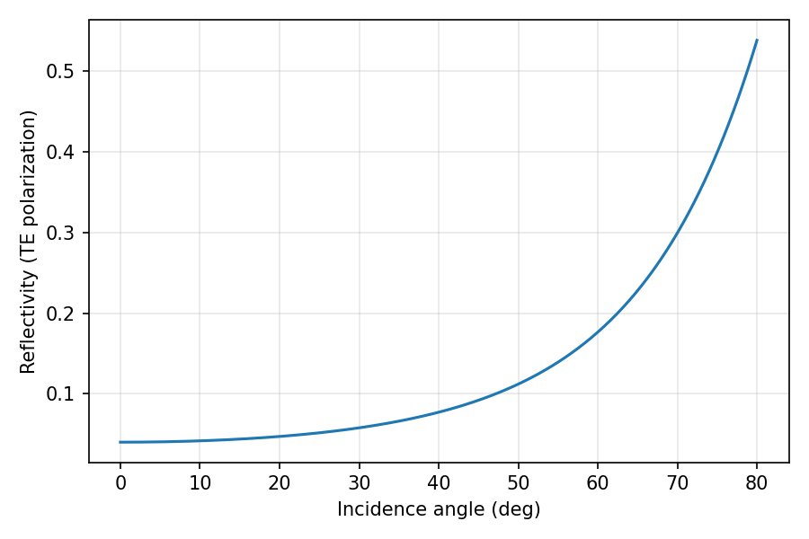
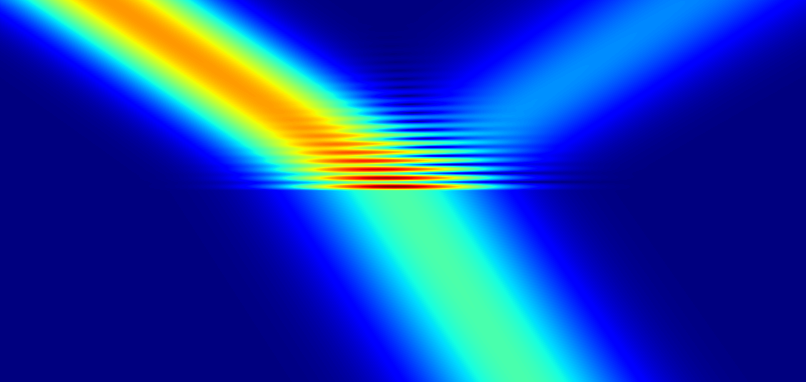
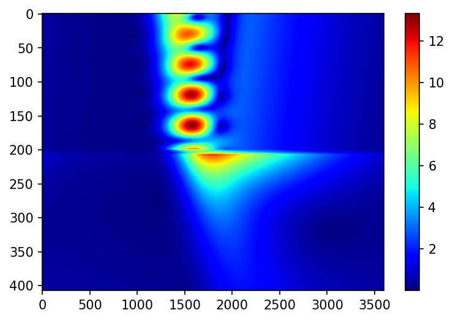

# PyMoosh

A Python-based Multilayer Optics Optimization and Simulation Hub !

## A versatile tool for teaching and research in optics

PyMoosh is a versatile numerical tool written in Python that simulates light interaction with multilayered structures.

Much like a Swiss Army knife, PyMoosh offers a comprehensive set of functionalities while its code remains easy to understand and modify. Its user-friendly design makes it accessible to first-year students who can quickly compute basic properties like reflection coefficients, while advanced users (researchers) benefit from sophisticated features including complex material models and optimization tools.

PyMoosh is particularly valuable for research in fields such as plasmonics, photovoltaics, and ellipsometry. The library comes with extensive Jupyter Notebooks that demonstrate all its capabilities and facilitate learning.

We are continuously developing PyMoosh, adding new features while prioritizing backward compatibility. Our team provides support and welcomes suggestions for improvement from the user community.


## Installation and Setup

### Requirements
- **Python 3.10 or higher** is required for RefractiveIndex library integration
- If your Python version is older than this, PyMoosh will be installed without the RefractiveIndex library.

### Basic Installation

**For Python <= 3.10:**

```bash
pip install pymoosh
```

**For Python 3.11+:**

Python 3.11+ requires using virtual environments. For this, you may use either `venv` or [conda](https://docs.conda.io/projects/conda/en/latest/index.html). We recommend the latter.

### `venv` installation (Linux mostly)
```bash
# Create and activate a virtual environment
python -m venv pymoosh-env
# On Linux/macOS:
source pymoosh-env/bin/activate
# On Windows:
pymoosh-env\Scripts\activate

# Install PyMoosh
pip install pymoosh
```

### Conda Installation (any OS)
```bash
# Create and activate environment
conda create -n pymoosh python=X.XX # change for the Python version you want. If not important, 3.11 works fine
conda activate pymoosh # activate the environment

# Install dependencies first, then PyMoosh
conda install -c conda-forge numpy scipy matplotlib jupyter
pip install pymoosh
```

Remember to activate your environment each time you use PyMoosh.

### Local installation

Maybe you don't want to use `pip`, maybe you want to better control what parts of PyMoosh you use. In this case, you can copy the PyMoosh folder of this repository on your personal computer, and then any script saved in this folder can call PyMoosh directly!

## Quick Start Example

PyMoosh is designed to be simple and intuitive. Here's a minimal working example to get you started:

```python
from PyMoosh import *
import matplotlib.pyplot as plt
# Define a simple interface (air/glass)
wl = 600  # wavelength in nm
interface = Structure([1., 2.25], [0, 1], [20*wl, 20*wl])
# Compute and represent its reflection coefficient
incidence, r, t, R, T = angular(interface, wl, 0, 0., 80., 400)
plt.plot(incidence, R)
plt.savefig('fresnel.png')
# Define the window and the incident beam of light
# Arguments : width, relative position of the beam, resolution in x and y
domain = Window(100*wl, 0.2, 10., 10.)
# Define the incident Beam
# Wavelength, incidence angle, polarization,
beam = Beam(wl, 56.3/180*np.pi, 0, 10*wl)
# Compute the field
E_field = field(interface, beam, domain)
# Visualize the result
plt.figure()
plt.imshow(np.abs(E_field), cmap='jet', extent=[0, domain.width, 0, sum(interface.thickness)])
plt.axis('off')
plt.savefig('refraction.png')
plt.show()
```

The code above produces these results:

**Reflection coefficient vs. incidence angle:**



**Light refraction at an air/glass interface:**



With just these few lines, you can calculate and visualize electromagnetic fields and reflection coefficients for multilayered structures. The examples above demonstrate a simple air/glass interface, but PyMoosh can handle complex stacks with many materials and layers.


## References and Scientific Publications

### List of functions

For a quick and handy list of all functions defined in PyMoosh, with their inputs and outputs, have a look at the `PyMoosh_function_list` pdf on this repository.

### Technical Documentation
For a detailed and regularly updated technical description of PyMoosh, see our [arXiv paper](https://arxiv.org/abs/2309.00654).

### Tutorial Papers
PyMoosh has been released with a trilogy of tutorial papers, that are open access:

1. **Official PyMoosh Presentation Paper**  
   [Journal of the Optical Society of America B, 41(2), A67-A78 (2024)](https://opg.optica.org/josab/fulltext.cfm?uri=josab-41-2-A67)

   And the [up-to-date version on ArXiv](https://arxiv.org/abs/2309.00654), with minor typo corrections.

   If you use PyMoosh in your research, please cite:
   ```bibtex
   @article{langevin2024pymoosh,
     title={PyMoosh: a comprehensive numerical toolkit for computing the optical properties of multilayered structures},
     author={Langevin, Denis and Bennet, Pauline and Khaireh-Walieh, Abdourahman and Wiecha, Peter and Teytaud, Olivier and Moreau, Antoine},
     journal={Journal of the Optical Society of America B},
     volume={41},
     number={2},
     pages={A67--A78},
     year={2024},
     publisher={Optica Publishing Group}
   }
   ```

2. **Global Optimization in Nanophotonics Tutorial**  
   [Journal of the Optical Society of America B, 41(2), A126 (2024)](https://opg.optica.org/josab/fulltext.cfm?uri=josab-41-2-A126)  
   And a bunch of informative Jupyter notebooks can be found in this [repository](https://github.com/Ellawin/tuto_global_optimization_photonics)

3. **Challenges of Deep Learning for Inverse Design**  
   [Nanophotonics (2023)](https://www.degruyterbrill.com/document/doi/10.1515/nanoph-2023-0527/pdf?licenseType=open-access)

### Research Applications
PyMoosh is a research-grade program. PyMoosh and its predecessor Moosh have been used in various research projects:

- [Comparing evolutionary algorithms and real evolution](https://www.nature.com/articles/s41598-020-68719-3) - The first direct comparison of its kind
- [Universal features of beam reflection by multilayers](https://arxiv.org/abs/1609.08473) - Demonstrating unintuitive optical phenomena
- [Simulating exotic "non-specular" phenomena](https://jeos.edpsciences.org/articles/jeos/pdf/2010/01/jeos20100510025.pdf)

## Illustrations

A punctual source inside a dielectric layer :




Excitation of a surface plasmon using a prism coupler in the Kretschman Raether configuration.

## Contributors

Here is a list of contributors to PyMoosh (one way or another) so far:

* Sarah Abdul-salam
* Pauline Bennet (@Ellawin)
* Tristan Berthelot (@Tilmedor)
* Anorld Capo-Chichi
* Pierre Chevalier
* Aidan Costard (@Dratsa)
* Hassan Fawaz (@hbfawaz)
* Denis Langevin (@Milloupe)
* Demetrio Macias
* Téo Mottin (@HawhawPdB)
* Amine Sakkali
* Olivier Teytaud (@teytaud)
* Antoine Vezon
* Peter R. Wiecha

and the contributors to the original Moosh program should not be forgotten : Josselin Defrance, Rémi Pollès, Fabien Krayzel, Paul-Henri Tichit, Jessica Benedicto mainly, but David R. Smith and Cristian Ciraci too ! Special thanks to Gérard Granet and Jean-Pierre Plumey.
