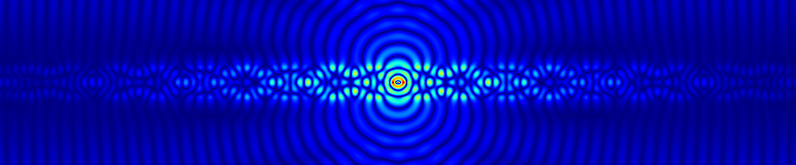

# PyMoosh

## About PyMoosh

PyMoosh is a open source, user-friendly library for the optical study of multilayered structures, written in Python. 

PyMoosh is now much more advanced than Moosh, the original octave/matlab program we used in the past. Importantly, the use of PyMoosh is illustrated by many Jupyter notebooks, and more are planned. PyMoosh can be used for teaching or research purposes. It is specifically written to be stable and quick, for its use in an optimization framework for instance.

It has also been thoroughly described in this [tutorial published in JOSA-B](https://opg.optica.org/josab/fulltext.cfm?uri=josab-41-2-A67&id=545746).



## Installation

**Python >3.10 is necessary for the inclusion of the RefractiveIndex library**

If this is an issue for you, tell us! We'll make a RefractiveIndex-less version.

**If you are using Python <3.11:**
You can do something as simple as 

``` pip install pymoosh ```

**As of Python >3.11:**
It is now a requirement to install external libraries (=libraries not managed by the Python team) in virtual environments. To do so:

``` python -m venv <venv_name> ```

``` source myvenv/bin/activate ```

``` pip install pymoosh ```

Now any time you need to use PyMoosh, make sure you have activated the corresponding virtual environment.

## Functionalities
PyMoosh allows you to compute most **properties of multilayered structures**, for any wavelength, incidence angle and polarization:
- reflection, transmission coefficients
- absorption in any layers
- PV efficiency
- resonant modes and zeros of the scattering matrix (and thus guided modes)
- field profiles
- green functions for dipolar emitters

**Material properties** (permittivities and permeabilities) can be either defined:
- with simple, non dispersive values
- through access to the [RefractiveIndex database](https://refractiveindex.info/)
- with a user-defined model, many common examples of which are predefined (Drude, Lorentz, Brendel&Bormann, Experimental Data interpolation)

More **advanced materials** are also available, to compute reflection and transmission coefficients (and hopefully, soon, the other properties too):
- Anisotropic materials
- Non-local (spatially-dispersive) materials

**Optimization algorithms** are also available, in the Differential Evolution framework. We also published [a tutorial in optimization on JOSA B](https://opg.optica.org/josab/fulltext.cfm?uri=josab-41-2-A126&id=546050).

## What's inside

- The *PyMoosh* folder contains all the code
- The *notebooks* folder contains the **Jupyter Notebooks** that explain how to use each functionality
- The *new_examples* folder contains directly usable and more easily modified versions of the jupyter notebook, for you to copy and adapt to your needs
- The *tests* folder contains a lot of stuff, mostly here for testing/historical reasons, and we don't particularly recommend reading through it

## For specialists

### Matrix formalisms
PyMoosh has been used to benchmark the speed and stability of all known optical formalisms at interfaces:
- Scattering matrices
- Transfer matrices
- Abélès formalism
- Dirichlet-to-Neumann maps
- Impedance formalism

The detail can be found in the article [below](https://opg.optica.org/josab/fulltext.cfm?uri=josab-41-2-A67&id=545746), but the short version is: use the S-matrices if time is not an issue, otherwise use the Abélès formalism (with care).

### Vectorized computations

Need faster computations? We have vectorized versions of wavelength/angular dependent plots in the ```vectorized.py``` script, to take advantage of efficient numpy computations.

### Mode finding

Mode finding uses a gradient descent of the reflection coefficient in the complex plane. We don't use complex integrals or fancy, efficient techniques (mostly because we don't have the time/expertise). If *you're* an expert, though, get in touch!

### Contribute

Found anything missing? You want to help? You're a student in optics and would like to work with us?

[Send us an email!](mailto:denis.langevin_at_uca.fr,antoine.moreau_at_uca.fr)

## References

PyMoosh is described in detail in this [tutorial published in JOSA-B](https://opg.optica.org/josab/fulltext.cfm?uri=josab-41-2-A67&id=545746).

You may cite it:
```
@article{Langevin:24,
author = {Denis Langevin and Pauline Bennet and Abdourahman Khaireh-Walieh and Peter Wiecha and Olivier Teytaud and Antoine Moreau},
journal = {J. Opt. Soc. Am. B},
keywords = {Deep learning; Optical computing; Optical filters; Optical properties; Resonant modes; Wavelength division multiplexing},
number = {2},
pages = {A67--A78},
publisher = {Optica Publishing Group},
title = {PyMoosh: a comprehensive numerical toolkit for computing the optical properties of multilayered structures},
volume = {41},
month = {Feb},
year = {2024},
url = {https://opg.optica.org/josab/abstract.cfm?URI=josab-41-2-A67},
doi = {10.1364/JOSAB.506175},
}
```

If you want to cite the repository, the 3.91 version of PyMoosh has been given a DOI :

[](https://doi.org/10.5281/zenodo.13845630)


Even if PyMoosh is quite simple, this is a research-grade program. We actually do research with it. We've done cool things, like [comparing evolutionary algorithms and real evolution for the first time in history](https://www.nature.com/articles/s41598-020-68719-3).

## Contributors

Here is a list of contributors to PyMoosh (one way or another) so far:

* Pauline Bennet (@Ellawin)
* Tristan Berthelot (@Tilmedor)
* Anorld Capo-Chichi
* Pierre Chevalier
* Aidan Costard (@Dratsa)
* Denis Langevin (@Milloupe)
* Demetrio Macias
* Téo Mottin (@HawhawPdB)
* Amine Sakkali
* Olivier Teytaud (@teytaud)
* Antoine Vezon
* Peter R. Wiecha

and the contributors to the original Moosh program should not be forgotten : Josselin Defrance, Rémi Pollès, Fabien Krayzel, Paul-Henri Tichit, Jessica Benedicto mainly, but David R. Smith and Cristian Ciraci too ! Special thanks to Gérard Granet and Jean-Pierre Plumey.
